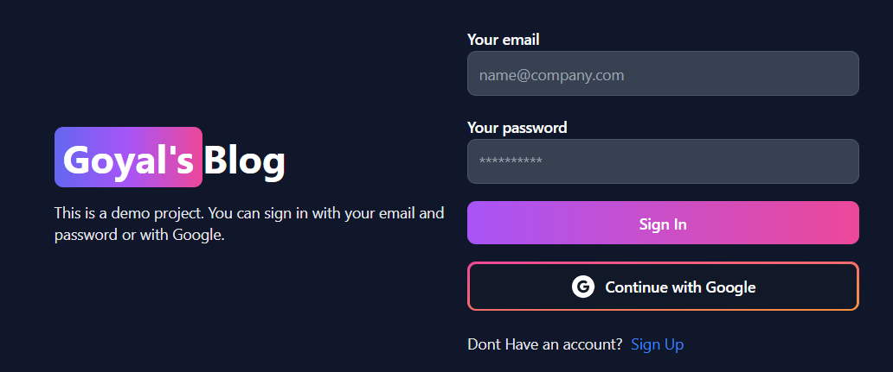
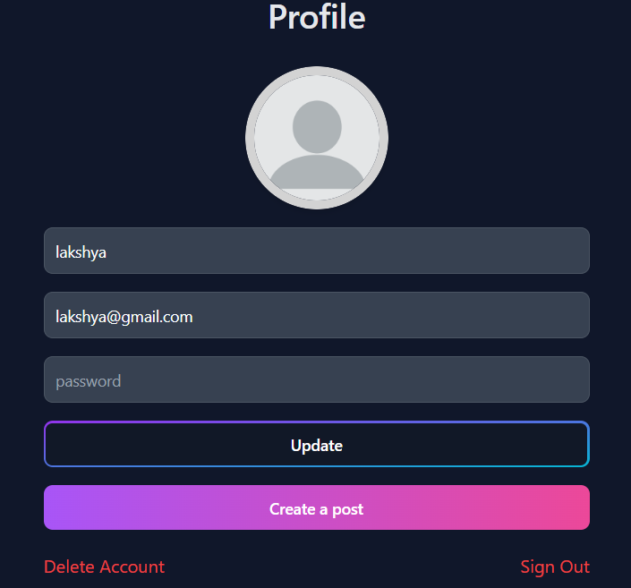
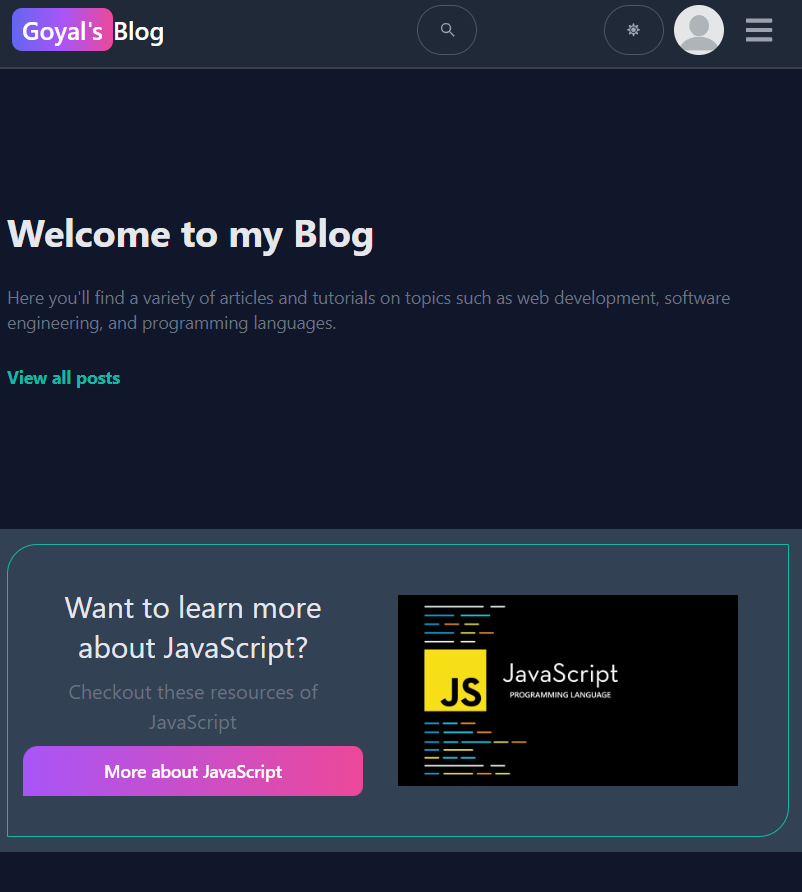
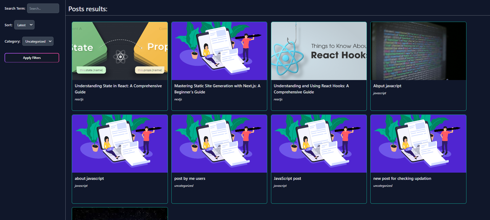
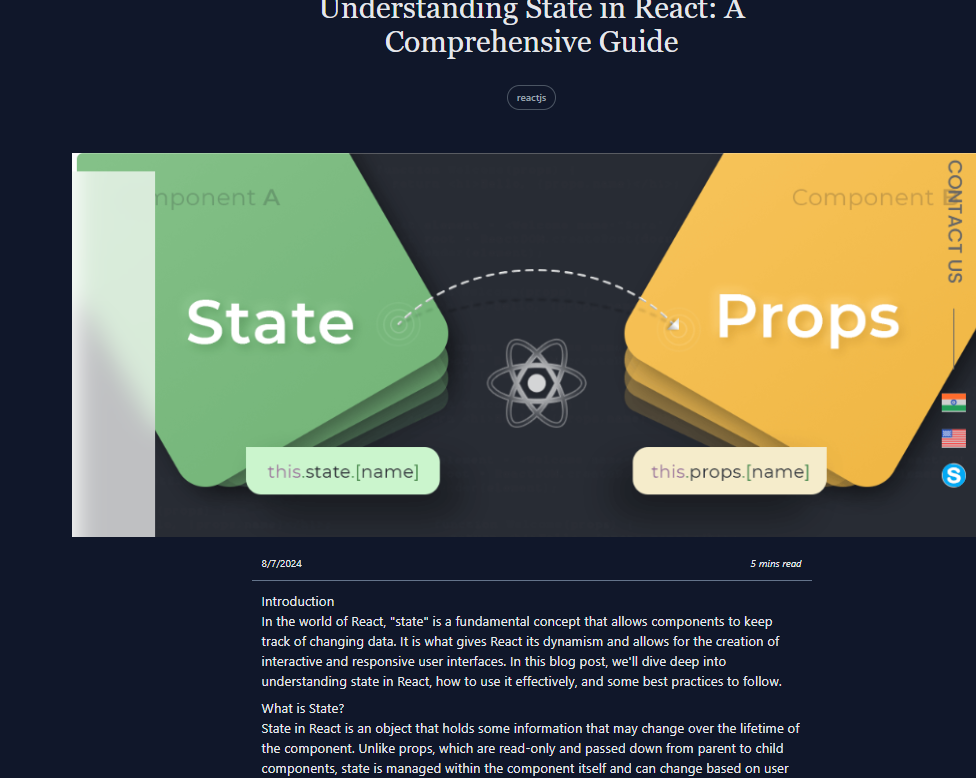

# Goyal Blog

Welcome to **Goyal Blog**, a personal blogging platform where I share insightful posts on various technologies such as ReactJS, NodeJS, JavaScript, Next.js, and more. This platform is designed to help users understand and stay updated with the latest trends and concepts in the tech world.

## Features

- **User Authentication**: Users can sign up and log in to the platform.
- **Technology Posts**: Access a variety of posts related to different technologies.
- **Comments and Likes**: Engage with posts by commenting and liking them.
- **User-Friendly Interface**: Clean and intuitive design for an enjoyable reading experience.

   
   
     
   
   
   

## Usage

1. **Sign Up and Log In**

    Create a new account or log in with your existing credentials to access the full features of the blog.

2. **Read Posts**

    Browse through the various posts on ReactJS, NodeJS, JavaScript, Next.js, and more.

3. **Comment and Like**

    Engage with the content by commenting on and liking posts to share your thoughts and feedback.

## License

Distributed under the MIT License. See `LICENSE` for more information.

## Contact

Abhishek Goyal - [My Email](mailto:agoyal0308@gmail.com)

Project Link: [https://goyalblog.vercel.app/](https://goyalblog.vercel.app/)
